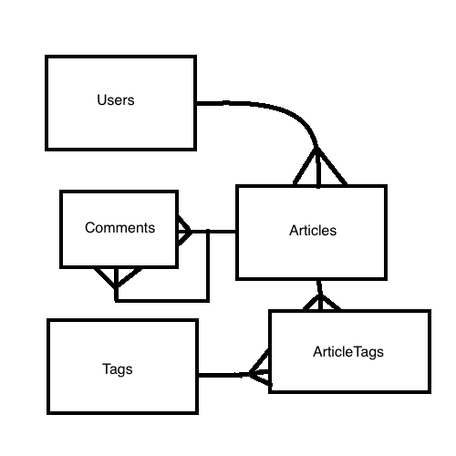

# Performance Talk
## Common Refactorings

## Part 2: More Relationships

Sometimes we want to add functionality that seems like a simple model until we realize that our association is not quite as simple as we would have hoped.

Let's try to add the ability to comment on a blog. This seems straight forward.

* We could model this association as a simple `1:N`, but in reality we lose the ability to have subcomments or `nested comments`.

## Phase 1: Implementing A Polymorphic Association

We want to add a polymorphic association to our application when we have the following situation

* A new model that can belong to many different models
* A single model can only belong to one other model at any given time.

Another good example would be adding a comment:

* A comment can either belong to an `article` or another `comment` but it cannot belong to both at the same time.

## Part 2: Planning Our Relationship

* Comments

| text | user_id | commentable_id | commentable_type |
| :--- | :--- | :--- | :--- |
| text from the comment | the `user_id` of the person who left it | the `id` of the model it belongs_to | the name of table where to look up the id |

### Question 

* What will our updated ERD look like with the new comments model?

### Answer

## Part 2: Implementation

* Generate the `comment` model with the appropriate attributes.
* Update the `comment` and `article` to have the appropriate associations.

We will wait until a later section to actually generate views to help manage commenting, but you should try testing that comments work in the `rails console`.

